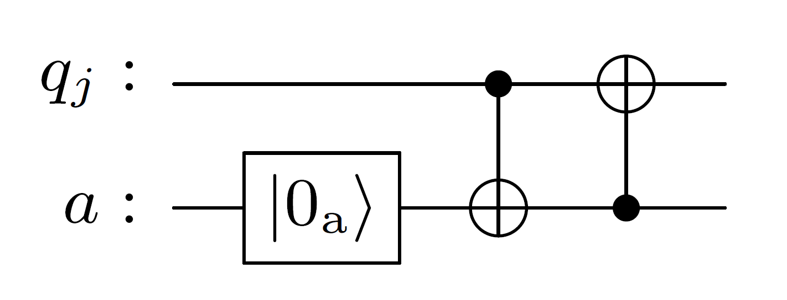
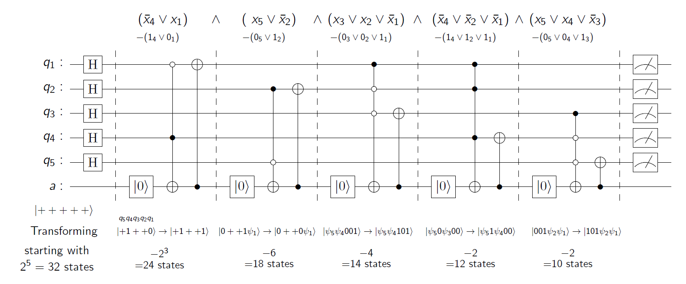

# k-SAT-problem-solution
### We present a simple quantum solution to the k-SAT/Boolean satisfiability problems

## Usage
- To very the algorithm, you can run the sat_sol_complete.ipynb file.
- You may enter your boolean function in the variable "Bfunc" in the second cell and run the notebook.
- Uncomment the last cell to visualize the quantum circuit generated for the given boolean function.
- The second last cell shall provide you with the comparision of classical and quantum solutions to the problem and the complexity of the quantum circuit genrated.
- For the cases where no solution exists, the algorithm will return the complexity as "None" indicating the failure to converge to a solution.

## Overview
The Boolean Satisfiability Problem (SAT) is a foundational decision problem in computational complexity and mathematical logic. Given a Boolean formula composed of variables and logical operators, SAT asks whether there exists an assignment of truth values (TRUE/FALSE) to the variables that makes the entire formula evaluate to TRUE. This problem serves as a cornerstone for understanding NP-completeness and has profound implications across computer science and quantum computing.

Our approach is based on the fact that a single quantum operator is capable of removing all the states that would not satisfy a particular clause from an equal superposition of all states. 
It is inspired by the dataset encoding method proposed by us in our work on structured quantum search. For more details, see [Prabhat et al., 2025](https://arxiv.org/abs/2504.03426).

Classically, to remove any arbitrary $N$ entries that would not satisfy a clause would require $N$ queries, hence the quantum advantage.
The operator in question is based on the non unitary AND operation using an ancilla qubit. It is defined as $\mathrm{\hat {A}}$, ${\mathrm{\hat {A}}} = CX_{ja}\cdot CX_{aj}$, where $j$ is the qubit corresponding to the variable in the clause, and $a$ is the ancilla qubit.

The operator ${\mathrm{\hat A}}$ acts on a superposition of all states, removing those that do not satisfy the clause by flipping the ancilla qubit to a specific state in a single operation.
This operator can be applied to each clause in the SAT problem, effectively filtering out all states that do not satisfy any of the clauses. The final state of the system will be a superposition of all satisfying assignments, which can then be measured to find a solution.

We extrapolate this AND gate to create clause operator ${\mathrm{\hat C}}$ that can be applied to a superposition of all states, removing those that do not satisfy the clause $C_i$.
If all the clauses have their separate target qubit without interfering with other clauses, we easily reach the perfect solution by applying them all in sequence.
However, if we have an overlap in the literals of two clauses, for example, consider $C_i$ and $C_r$ on literals $l_{ij}$ and $l_{rj}$, where $l_{ij}=\bar l_{rj}$.
Here, if we choose $q_j$ as the target qubit for clause $C_r$, we might create some states that would not satisfy clause $C_i$.
These states need to be removed again with the operator $\mathrm{\hat{C}}_i$ using a different target qubit.
For this purpose, we propose a conjecture that if there exists a state that satisfies all the clauses, it shall remain unaffected by the operations of $\mathrm{\hat{C}}_i$ for $1\le i\le m$.
Thus, we apply the same clause $\mathrm{\hat{C}}_i$ on multiple target qubits to completely weed out the accidentally created non-solution states again and again.
This makes sure we are only left with the solution states.

We propose an additional conjecture that says if there exists a solution state for a boolean problem, we shall always be able to reach it using the proposed operations while weeding out all the undesired solutions.
Thus we also suggest that an infinite loop of intersecting clauses would mean no satisfiable assignment to the said boolean problem exists.

## Complexity
The worst case classical complexity of creating such a quantum circuit is of $\mathcal{O}(m^2\cdot n^3)$.
The worst-case circuit depth of the quantum circuit generated comes out to be $\mathcal{O}(m^2)$. 
Here, we count each $\mathrm{\hat{C}}_i$ and respective CX operation as a single unit of circuit depth.

## Quantum circuit example 
The following example illustrates the application of the quantum operator to a specific k-SAT problem with 5 variables and 4 clauses. The clauses are represented as follows:
$$(\bar x_4 \lor x_1)\land ( x_5 \lor \bar x_2)\land(x_3 x_2 \lor \bar x_1)\land(\bar x_4 \lor\bar x_2\lor\bar x_1)\land(x_5\lor x_4 \lor \bar x_3) $$

The circuit applies the operator ${\mathrm{\hat C}}$ for each clause, effectively filtering out all states that do not satisfy any of the clauses. The final state of the system will be a superposition of all satisfying assignments, which can then be measured to find a solution.
Each clause is applied to a separate target qubit, ensuring that the operations do not interfere with each other. Here the circuit depth is 5, corresponding to the number of clauses.

## Known Issues
- The algorithm currently requires the clauses to be in CNF (Conjunctive Normal Form) and requires sorting of the clauses based on the number of literals in each clause.
- The algorithm currently does not handle single literal clauses robustly. For example boolean function contating $x_1$ or $(x_1 \lor x_2) \land (x_1 \lor \bar x_2)$ may not let the algorithm to converge. In such cases, it may produce extra non-solution states along with a complexity value as "None".
- Use of machine learning and reinforcement learning to optimize the circuit generation is not yet implemented; we expect it to improve the circuit depth and performance.
- We are still working to resolve certain edge cases where the algorithm may not converge to a solution, particularly in cases with complex overlapping clauses. These can be addressed by reordering of clauses, we hope for a more robust solution in the future. 
- Note that the work is still in progress, and we are actively working on improving the algorithm and its implementation. We welcome contributions and suggestions to enhance the solution.

## References
- Y. Prabhat, S. Thakur, and A. Raina, Structured quantum search algorithm: A quantum leap, arXiv preprint
2504.03426 (2025).
